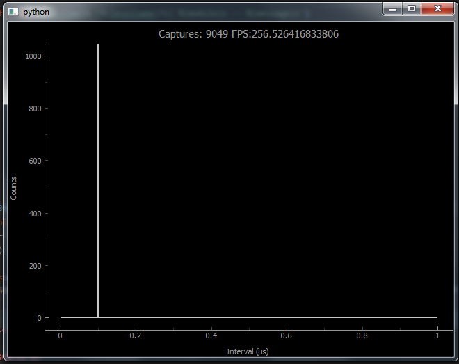
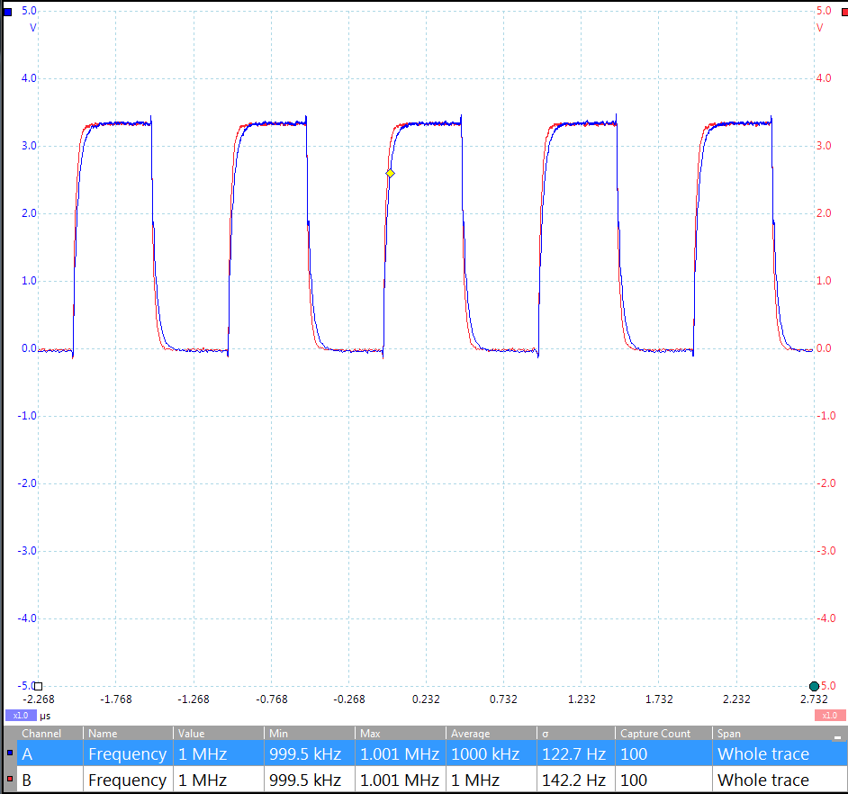
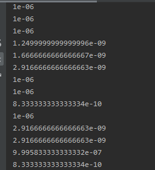

Quickstart and examples
=======================
This page will outline the usage of the Time Controller, either through the examples or through custom calls to the API.

Hardware Setup:
^^^^^^^^^^^^^^^^^^^^^

Old level shifter boards
""""""""""""""""""""""""
Ensure that the two level shifted boards (if the one used is the same as designed in the supplied gerber files) are connected to each PMOD port. Make sure that the ``GND`` and ``VCC`` lines match with 

both the indications on the level shifter board and the Pynq board. (On the Pynq Z2, the PMOD ports may not have ``VCC`` and ``GND`` labelled, in this case the ``GND`` and ``VCC`` pins are on the opposite side of the PMOD from the pin marked 1).

.. image:: /images/pmodpynq.png

.. image:: /images/pmodlvl.png

When connecting timing signals to the BNC ports on the level shifters, ensure that each common timing signal has been connected using length matched cables to ensure timing bias is minimal.

New Level shifter boards
""""""""""""""""""""""""
**If running in default mode**

Connect the PMOD cable from the PMOD interface on the Pynq marked PMODB to the board marked INPUT BOARD on the PMOD header marked DEF.

Connect the PMOD cable from the PMOD interface on the Pynq marked PMODA to the board marked OUTPUT BOARD.

**If running in high resolution mode**

Connect the PMOD cable from the PMOD interface on the Pynq marked PMODB to the board marked INPUT BOARD on the PMOD header marked HR.

The other PMOD interface on the Pynq can be left unconnected.

Timing Signal Generation and Analysis:
^^^^^^^^^^^^^^^^^^^^^^^^^^^^^^^^^^^^^^
In order to generate predictable timing signals used in the following examples, a Digital Delay Generator such as the `DG535 <https://www.thinksrs.com/products/dg535.html>`_
digital delay generator. Otherwise, using the built in signal generator will also suffice.

In order to view the output signals of the signal generator, a four channel high bandwidth oscilloscope (>100MHz) would be ideal. However a lower end scope would suffice however high frequency output signals or short pulses will likely not be visible.

Examples
^^^^^^^^
Below are 5 examples of the Time Controller in operation.

Single channel inter rising edge timing histogram
""""""""""""""""""""""""""""""""""""""""""""""""""

Run the ``SingleChannelInterRisingEdgeHist.py`` python script (ensure the packages listed in prerequisites are installed first).

The histogram will load and eventually begin populating the relevant bin for the timing signal being supplied to channel 1. In this example's case, the timing signal is two pulses 100ns apart.

Two channel coincidence timer histogram
""""""""""""""""""""""""""""""""""""""""

Run the ``CoincidenceTimerHist.py`` python script. This histogram will begin populating the relevant bin for the difference in time between two rising edges on two timing signals supplied to channels 1 

and 2.

    In this case, the two timing signals given were two pulses seperated by 200ns with the first channel being first.

.. image:: /images/CTHIST.png

Time tagger histogram
""""""""""""""""""""""

Run the ``TimeTaggerHist.py`` python script. This histogram will begin populating the timing bins for the timing offset for each channel (1 to 4) from the T0 channel. In this case, each channel was 

offset from T0 by an increasing multiple of 100ns.

.. image:: /images/TTHIST.png

Pulse Counter
"""""""""""""
Run the ``PulseCounter.py`` script. Connect a known frequency to each channel (in this case the signal was a 1 MHz signal replicated on each channel).
The counte will run with a counting window of one second after which it will output the result to the python output window.

.. image:: /images/counter.png

Signal Generator
""""""""""""""""
Run the ``SignalGenerator.py`` script. Connect each of the output ports to an oscilloscope and verify that each output is a 100KHz square wave with a duty cycle of 50%. Below is the result expected on 

a two channel scope (a higher bandwidth scope should have better signal integrity).

(There is some difference in delay in the above example image due to use of BNC cables of varying length (the cable length of channel B is shorter).

High Resolution Single Channel Inter rising edge timer
""""""""""""""""""""""""""""""""""""""""""""""""""""""
Warning: This mode is highly unreliable without a way to properly distribute the same signal to all four top PMOD inputs, it will require manually calibrating all the input delays to ensure each signal arrives at the FPGA at the same time for sampling.

Run the ``HighResolutionMode.py`` script, ensure that a known timing signal (either two pulses apart from each other by a known delay or a high speed clock signal) is either replicated on every BNC input on the level shifter board with length matched cables OR using another level shifter to replicate the same signal on all PMOD pins.

The result should be as follows for a 1MHz clock signal:

As seen, the mode is highly unreliable and requires considerable delay calibration to be useful.

Indicator Lights and miscellaneous test points
^^^^^^^^^^^^^^^^^^^^^^^^^^^^^^^^^^^^^^^^^^^^^^
On the Pynq there are two RGB LEDs which indicate the operation of each TDC module.

When the single channel inter rising edge timer is armed, the LED marked LD4 will glow green indicating that the module is armed. LD5 will glow green when the start signal has been acquired and the module is waiting for the stop signal.

The same type of operation applies to the other modules however in the coincidence timer's case the LEDs will glow red, and in the time tagger's case the LEDs will glow blue.

The four LEDs next to the buttons indicate the phase lock of the internal clock synthesizers and whether the signal generator has finished its current configuration.

Finally, the bottom 4 pins on PMODA on the Pynq are the input signals repeated after being delayed. On the level shifter, they are the output BNCs on the T0/E_TRIG board.
