Theory of Operation
===================
This Time Controller suite consists of 5 separate sub-modules as listed below.

- Pulse Counter
- Signal Generator
- Single Channel inter rising edge timer
- Two channel coincidence timer
- Four channel time tagger

Additionally, this page will describe the operation of utility functions this suite performs such as input delay calibration, high speed channel sampling and high speed data acquisition.

Each module's operation will be described in detail in the following sub-sections after which the utility functions will be described.

Active Modules
^^^^^^^^^^^^^^^^

Pulse Counter
"""""""""""""
The pulse counter is a simple synchronous counter implemented using the Binary Counter Xilinx IP Core, the counting window is also measured using exactly the same counter however connected to a system clock. This same system clock operates the surrounding logic to achieve the following modes of operation.

Manual Operation
*****************
The counter module has 3 types of operation, the first is when the user sets the window and manually starts the counter from software. 

In this mode, the user will hold the counter module in reset and specify a window to the module which it will update during reset. The time window value is calculated by using the clock frequency of the timer clock (124.688MHz) and multiplying it with the time in seconds. 

Next the user can pull the counter module out of reset upon which it will begin counting incoming pulses while the window timer starts timing. 

After the window has elapsed, the data ready indicator will activate and the counter will hold its value waiting for the user to read it. 

Once the user has finished reading the data, the user can put the module into reset again and repeat.

The following timing diagram outlines this operation:

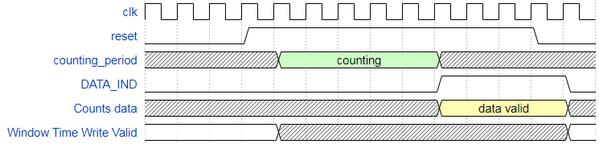

Due to pipelined operation, the counting period is always one timer clock cycle short, therefore the time window value must be incremented once before being written.

Externally Triggered
********************
The next mode is when the user supplies an external start signal to signal the start of counting until the user specified window.

In this mode the user will hold the module in reset while writing the counting window to the module.

After the user pulls the module out of reset, the module will wait for the trigger signal on the T0 channel. Once it gets this pulse it will begin counting until the counting window elapses.

The following timing diagram describes this operation:

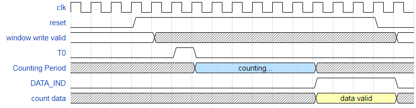

Externally Triggered and stopped
********************************
The final mode is when the user does not supply a predefined window and instead supplies individual start and stop signals.

In this mode the user will initially hold the module in reset, and then pull it out of reset.

The module will wait until it receives the start signal on the T0 channel. It will begin counting until it receives a stop signal on the E_TRIG channel where after receiving it, the counts data will be available to be read.

The following timing diagram outlines its operation:

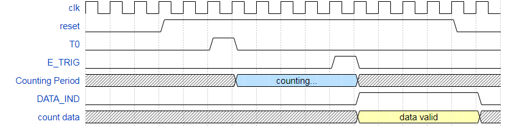

Signal Generator
"""""""""""""""""
The implemented signal generator in this time controller consists of 4 output channels capable of outputting signals with configurable frequencies, pulse widths and delays. Each channel is phase coherent allowing integer multiples of frequencies to be generated with minimal drift.

The basis behind the implementation is the Xilinx DDS Compiler IP core which synthesizes a binary encoded sinusoid waveform using a sinusoid look up table stored using block RAM, the frequency of the waveform must be set by first calculating the required phase increments by using the required frequency, the reference clock and the phase bit depth of the DDS Compiler. The phase increment states how much the phase of the sinusoid must increment per clock cycle to ensure the output waveform has the required frequency. The number of possible phase states (from zero to :math:`2\pi`) of the DDS depends on the phase bit depth.
The derived expression below allows the calculation of the required phase increment

.. math::

   \frac{f_{out}\cdot 2^{depth}}{f_{clk}}=\Delta \theta

The bit depth used in the case of the time controller is 48 bits while the reference clock frequency is 460MHz.

The surrounding logic acts as a level detector and turns the waveform into a square wave of half frequency. The next set of logic will alter the square wave with a duty cycle by triggering on the input waveform and starting a counter similar to other digital PWM generators except externally triggered. This counter will count up to a certain value supplied by the user which is calculated by multiplying the number of ref_clk cycles that fit in one period of the expected frequency with the fractional duty cycle.

When the counter value is below this value, this module will output a zero, after it is exceeded the module will output a one.

The resulting output is a new square wave with a variable duty cycle.

The delays are configured by running a single counter, the user supplies 4 counter values, for each channel. As the counter exceeds these four values, the respective channel will be pulled out of reset effectively delaying their start.

As the frequency resolution of the DDS compiler is not zero (it is 1.634 microhertz), there will be some drift or inaccuracy with the output signal's frequency. This may cause minor drift with some integer multiples of signals. It is most prevalent in low frequency signals and much less prevalent in high frequency signals. The average drift can vary from 10 nanoseconds every second up to 1 microsecond at moderate frequencies (10-10000Hz) to every 0.6 seconds at the lowest frequencies (0.1 to 1Hz).

 
The following timing diagrams outline each part of the logic:

DDS Compiler
*****************
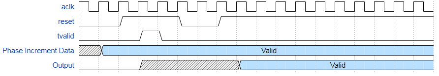

Above it is shown that the core must be placed into reset twice, this is because the phase increment data will not be written to the internal registers of the core when tvalid is pulsed unless the core is not in reset. Therefore the core must be taken out of reset to be written to and then placed into reset, and then taken out again to ensure it is synchronized with every other core. 

During the time between the two resets, the output is invalid.

Delay Generator
*****************
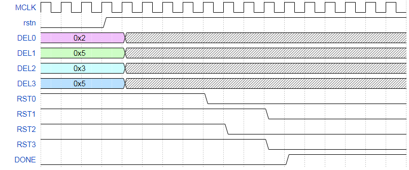

As shown above, the input delay values which are 32 bit must be written to the module while it is in reset.

After pulling the module out reset it starts an internal timer which as each delay value is reached outputs high for each corresponding reset output.

The DONE output will be asserted after all the output resets are high which will signal that the signal generator is stable and has finished.

Pulse Width Modulator
*********************
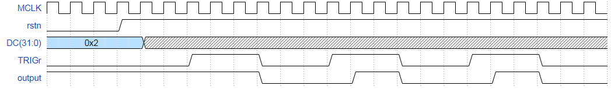

As shown in the above timing diagram, the resulting signal has a small duty cycle defined by the DC signal of 0x2 (which results in a signal that is a high pulse 2 clock cycles wide).

Single Channel Inter Rising Edge Timer
""""""""""""""""""""""""""""""""""""""
The basis of this module is simply a counter that starts when the module detects a rising edge on the input and stops when another rising edge is detected. However to increase the resolution further the input is actually a 8 bit wide deserialized output from an ISERDES (which will be explained later). Rising edge detection is performed on this bit vector by simply checking both the current and last vectors (the vectors are effectively samples that occur every coarse clock). If there is a 0 on the last bit of the last vector and a 1 on the first bit of the current vector, this would be a rising edge. Otherwise if there was a 0  followed by a 1 on the current vector, this would also be classified as a rising edge. However in this case, how far down the rising edge was from the end of the array is also recorded, this is a fine time offset which will be applied to the final time during time calculations and signifies how many of the high speed clock cycles occurred which clocked a logic high on the input until the coarse clock rising edge.

The following timing diagram outlines its operation and expected output.

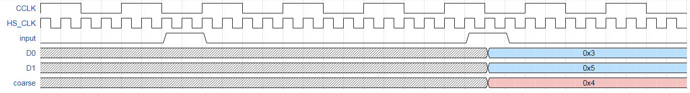

As shown above there are 3 outputs, coarse, D0 and D1. The value of coarse can be multiplied by 8 (due to DDR sampling) and the values of D0 and D1 are added and subtracted respectively to give the total number of HS_CLK edges between the two input pulses. If the HS_CLK edges were associated with a time period, the time between the two input pulses can be found.

This forms the basis of the time to digital converter architecture used in the following modules as well.

Operation of this module is best described by the following timing diagram:

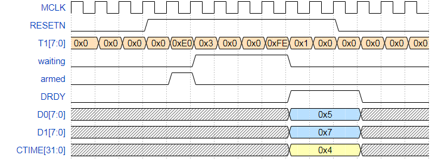

As shown above, after getting two pulses, the data becomes available and remains valid until the module is put in reset again. The DRDY (data ready) line goes high at the same time to signal to the host controller (whether its the Zynq processing system or another set of logic) that the data is ready to be acquired.

In this case in order to acquire as much data as fast as possible, a FIFO was used with a depth of 2048. The DRDY signal is used to place the module into reset effectively making the module free running. The DRDY also connects to a FIFO along with all the data signals. The DRDY acts as the write enable to the FIFO writing data to the FIFO each time data is ready.

The data is acquired from the FIFO using a FIFO read controller which when its request line is pulled high, it takes one point of data from the FIFO and enables the valid line for the processing system which can then record the data value.

This FIFO behavior is identical to both the Coincidence Timer and Time Tagger.

Coincidence Timer
""""""""""""""""""
The coincidence timer is designed to find the time between two rising edges on two channels. The user must first configure which channel to pick as the start signal and pull the module out of reset. The module will wait for a rising edge on the specified start line and once it acquires one, it will start an internal counter which will count until a rising edge on the other channel is detected.

The user can also decide to let the module pick whichever channel that has a rising edge first as the start signal.

The following is a timing diagram of this module:

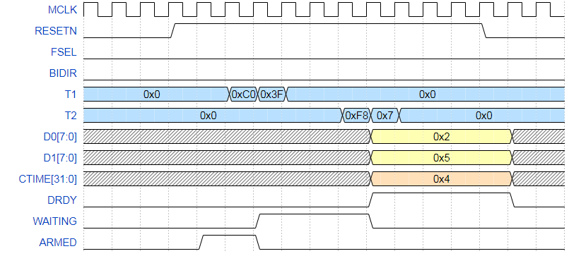

As show in the timing diagram, its operation is nearly identical to the previous module, except instead of awaiting for a start/stop signal on one line, it waits for a start and stop on two separate lines.

It interacts with the FIFO in the same way as the previous module.

Time Tagger
""""""""""""
The time tagger is designed to find four different offset times for 4 input channels from the reference channel T0. The time tagger requires a time out value which is the maximum time the time tagger waits for a pulse on a channel before declaring the channel as timed out and starting a new time tag.

The basic principle is exactly the same as the coincidence timer, except instead of awaiting for a single channel to pulse after a start signal, this module waits for 4 channels and records each one's timing offset fro start. The main difference is that the time tagger is free running and does not wait for any external logic to start and stop it. The DRDY signal toggles each time new data is available to be read allowing any external data reading logic to either be DDR based logic or can be software (e.g. processing system or microblaze).

In this case the DRDY signal goes into some extra logic that on toggle of the DRDY line, pulses the write enable line and writes a single record of data to the FIFO. All 4 coarse times and fine time offsets are concatenated into a 172 bit vector before being written to the FIFO. The data is sliced on the reading end of the FIFO and the read operation on this end is identical to previous modules.

The timing diagram for the time tagger is shown below:

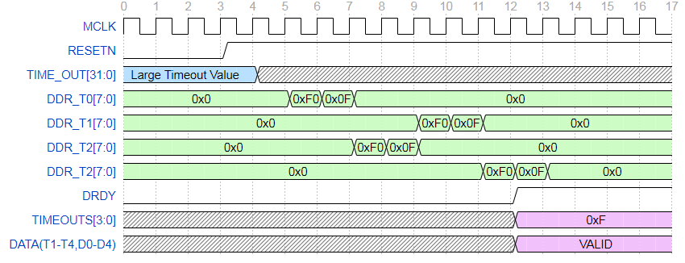

As shown above, the data is visible on the output after the toggling of DRDY until the next toggling.

Utility Operations
^^^^^^^^^^^^^^^^^^
In this section, the operation of the input sampling, input delays, AXI infrastructure  and miscellaneous logic will be explained.

Input Sampling
""""""""""""""
In order to achieve 625ps of accuracy in each of the TDC modules, the input sampling must be done at high clock speeds, the way this was done in this time controller was through the use of high speed input deserializers on the FPGA, also known as ISERDES.

The ISERDES are designed to deserialize incoming data into parallel form which can be clocked out at a far lower clock speed more easily handled by the FPGA fabric. As such the ISERDES require two clocks, one which is a high speed input sampling clock, and another which is the divided slower clock which can be generated by dividing the high speed clock by the serialization factor. The high speed clock is used to sample the data on the input while the divided clock is used to clock parallel data out of the ISERDES. The ISERDES can be configured to sample incoming data on both the rising and falling edges (DDR) effectively doubling the high speed clock.

In this case, the high speed clock provided to the ISERDES was 800MHz which is the highest possible frequency that can be synthesized using the FPGA's Mixed Mode Clock Managers (MMCMs). At DDR, this increases the clock frequency to effectively 1.6GHz. In this case the ISERDES was run at a serialization factor of 8 meaning there were 8 parallel outputs from the ISERDES, since the ISERDES is operating in DDR, this means that only 4 of the out parallel data is actually being clocked on a unique cycle, the rest are clocked on falling edges of the same clock cycles. This means the clock division factor for the divided clock is 4 resulting in a divided clock of 200MHz which is easily handled in the FPGA fabric.

This divided clock is also used as the master clock for all logic that is dependent on the data from the ISERDES. This includes all TDC modules (single channel inter rising edge timer, coincidence timer and the time tagger). This ensures all the modules are synchronized with the data output rate of the ISERDES.

The timing diagram for the operation of this primitive is shown below:

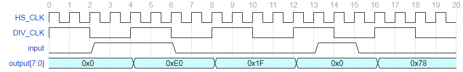

Input Delays
""""""""""""
The FPGA being used has the ability to introduce fine input delays as low as 51ps. This is done through the use of the IDELAYE2 primitive.

The IDELAYE2 primitive is an IO block component that consists of a delay line with 32 taps and the output tap can be either fixed or configured during operation.

The IDELAYE2 primitives all require a controller primitive which both calibrates and provides a reference clock frequency to generate the delays for each IDELAYE2 primitive. The valid input frequency ranges are 190-210MHz (which results in a delay of 78ps) and 290-310Mhz (which results in a delay of 51ps). The controller must be placed in the same clock region as the IDELAYE2 primitives it is calibrating, this however is done automatically using the Vivado Design Suite.

In this time controller's case, the IDELAYE2 primitives have a delay resolution of 78ps and have configurable tap outputs to allow live adjustment of input delays.

AXI Infrastructure
"""""""""""""""""""
Advanced eXtensible Interface (AXI) is a System on Chip (SoC) interface standard widely used to connect various subsystems of microprocessors or other chips. In this case, it is used to connect various modules on the Zynq programmable logic to the Zynq processing system.

One of the primary AXI peripherals used is the AXI GPIO peripheral that allows the processing system to read and output signals to the programmable logic. It is the primary means of extracting data from every module and configuring them.

Each AXI peripheral connects to an AXI interconnect which allows the processing system to address them and from there address their internal registers to configure their outputs.

Miscellaneous Modules
"""""""""""""""""""""
This final subsection will cover various modules such as the output controller for the signal generator and the clock generation.

The signal generator's outputs have the ability to enter a high impedance mode where the control of the output line can effectively be relinquished and will allow other external devices to control them without damaging the Zynq. 

The clocks on baod the programmable logic are generated from 3 seperate MMCMs. Their purposes are listed below:

- One MMCM is used to generate the clock for the window timer on the counter (124.688MHz) and the input delay reference clock (210MHz).
- Another is used to generate both the high speed 800MHz clock and the divided 200MHz clock to run the logic in each TDC module.
- The last is used to generate the reference clock for the signal generator which is 460MHz
